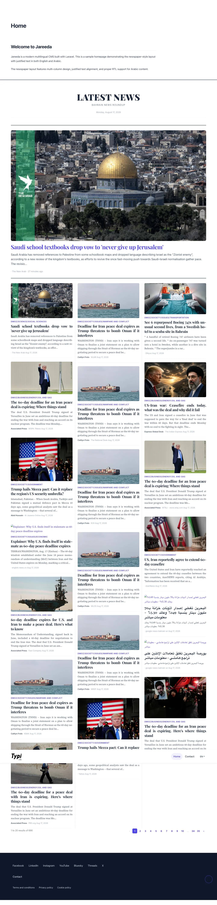
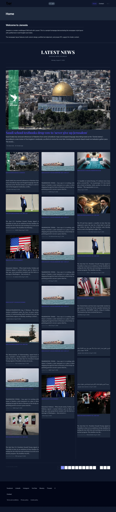
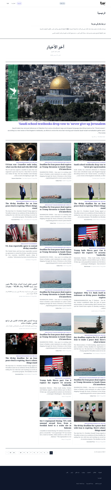
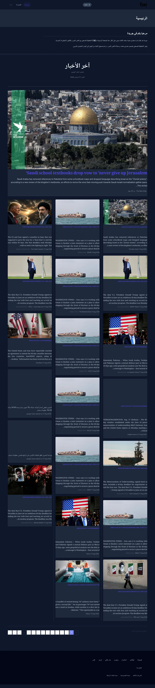

# Jareeda

Jareeda is a bilingual (`en` / `ar`) news CMS built on [TypiCMS](https://typicms.org) and [Laravel 13](https://laravel.com/docs/13.x).

| Runtime | Version |
| --- | --- |
| PHP | 8.5.9 (`^8.4`) |
| Laravel | 13.25.0 |
| TypiCMS Core | 17.0.39 |
| Vite | 8.2.1 |
| Vue | 3.5 |

Latest upgrade notes and screenshots: [docs/upgrade-2026.md](docs/upgrade-2026.md).  
Architecture decision: [docs/decisions/ADR-001-laravel-13-typicms-17.md](docs/decisions/ADR-001-laravel-13-typicms-17.md).  
News pipeline (fetch, images, caching): [docs/NEWS_PIPELINE.md](docs/NEWS_PIPELINE.md) · [docs/NEWSAPI.md](docs/NEWSAPI.md).

| Light | Dark |
| --- | --- |
|  |  |
|  |  |

## Table of contents

-   [Quick start](#quick-start)
-   [Features](#features)
-   [Requirements](#requirements)
-   [Installation](#installation)
    -   [Assets](#assets)
    -   [Locales configuration](#locales-configuration)
    -   [Installation of a module](#installation-of-a-module)
-   [Available modules](#available-modules)
    -   [Pages](#pages)
    -   [Menus](#menus)
    -   [Projects](#projects)
    -   [Categories](#categories)
    -   [Tags](#tags)
    -   [Events](#events)
    -   [News](#news)
    -   [Contacts](#contacts)
    -   [Partners](#partners)
    -   [Files](#files)
    -   [Users and roles](#users-and-roles)
    -   [Blocks](#blocks)
    -   [Translations](#translations)
    -   [Sitemap](#sitemap)
    -   [Settings](#settings)
    -   [History](#history)
-   [Facades](#facades)
-   [Artisan commands](#artisan-commands)
-   [Roadmap](#roadmap)
-   [Change log](#change-log)
-   [Contributing](#contributing)
-   [Credits](#credits)
-   [Licence](#licence)

## Quick start

```bash
composer install
pnpm install
cp .env.example .env   # if needed
php artisan key:generate --no-interaction
php artisan migrate --no-interaction
pnpm build
php artisan serve --host=127.0.0.1 --port=8010 --no-interaction
```

Public site: http://127.0.0.1:8010/en and http://127.0.0.1:8010/ar  
Admin: http://127.0.0.1:8010/admin (redirects to localized login)

| Command | Description |
| --- | --- |
| `pnpm dev` | Vite dev server |
| `pnpm build` | Production assets |
| `composer run dev` | App, queue, logs, and Vite together |
| `vendor/bin/pint --dirty` | Format changed PHP |

## Features

### URLs

These kind of URLs are managed by the CMS:

**Modules:**

-   /en/events/slug-in-english
-   /fr/evenements/slug-en-francais

**Pages:**

-   /en/parent-pages-slug-en/subpage-slug-en/page-slug-en
-   /fr/parent-pages-slug-fr/subpage-slug-fr/page-slug-fr

## Requirements

-   PHP 8.4+ (8.5.9 is the current local runtime)
-   SQLite (default local) or MySQL 8 / MariaDB
-   Composer 2.10+
-   Node 22+ and pnpm 11+ (or Bun) for Vite 8
-   BCMath, Ctype, JSON, Mbstring, OpenSSL, PDO, Tokenizer, XML PHP extensions

## Installation

First install [Composer](https://getcomposer.org)

1. Create a new project

    ```
    composer create-project typicms/base mywebsite
    ```

2. Enter the newly created folder

    ```
    cd mywebsite
    ```

3. Migration of the database, seeding, user creation, npm packages installation and directory permissions.

    ```
    php artisan typicms:install
    ```

Note: if you use MariaDB, set 'mariadb' to true in config/typicms.php

Go to http://mywebsite.test/admin and log in.

### Assets

Assets are bundled with [Vite 8](https://laravel.com/docs/13.x/vite) and `laravel-vite-plugin` 3.

```bash
pnpm install
pnpm dev      # watch
pnpm build    # production
```

Bun (`bun install` / `bun run dev`) still works if that is your local package manager. After frontend changes, rebuild or run the Vite dev server or the UI will keep serving `public/build`.

### Locales configuration

1. Set the locales in config/typicms.php, the first key of this array is the main locale and should be the same as the locale defined in config/app.php.
2. Set main_locale_in_url in config/typicms.php to true or false.

### Installation of a module

This example is for the News module. After these steps, the module will appear in the sidebar of the back office.
If you need to customize it, you can [publish it](#publish-a-module)!

1. Install a module with Composer

    ```
    composer require typicms/news
    ```

2. Add `TypiCMS\Modules\News\Providers\ModuleServiceProvider::class,` to **config/app.php**, before `TypiCMS\Modules\Core\Providers\ModuleServiceProvider::class,`
3. Publish the views and migrations

    ```
    php artisan vendor:publish
    ```

4. Migrate the database

    ```
    php artisan migrate
    ```

### Module scaffolding

Let’s create a module called Cats.

1. Create the module with artisan:

    ```
    php artisan typicms:create cats
    ```

2. The module is in **/Modules/Cats**, you can customize it
3. Add `TypiCMS\Modules\Cats\Providers\ModuleServiceProvider::class,` to **config/app.php**, before `TypiCMS\Modules\Core\Providers\ModuleServiceProvider::class,`
4. Migrate the database

    ```
    php artisan migrate
    ```

## Available modules

Each module can be [published](#publish-a-module).

### Pages

Pages are nestable with a drag and drop, on drop, URIs are generated and saved in the database.
Each translation of a page has its own route.
A page can be linked to a module.
A page can have multiple sections.

### Menus

Each menu has nestable entries. One entry can be linked to a page or URL.
You can return a HTML formated menu with `Menus::render('menuname')` or `@menu('menuname')`.

### Projects

Projects have categories, projects URLs follows this pattern: /en/projects/category-slug/project-slug

### Tags

Tags are linked to projects and use the [Selectize](https://brianreavis.github.io/selectize.js/) plugin.
The tags module has many to many polymorphic relations so a tag can be easily linked to any module.

### Events

Events have starting and ending dates.

### News

Beyond the standard TypiCMS News module, Jareeda adds a full aggregation pipeline: scheduled fetches from NewsAPI.ai, NewsData.io, and Bahrain RSS feeds, article deduplication, and a multi-tier image fallback (source scraping → AI generation → SVG placeholder). See [docs/NEWS_PIPELINE.md](docs/NEWS_PIPELINE.md) for commands, caching strategy, and known gotchas.

The public homepage also ships a dark-mode toggle (`localStorage`-persisted, respects `prefers-color-scheme`) and full Arabic RTL layout — see the screenshots above.

### Contacts

Frontend contact form and admin side records management.

### Partners

A partner has a logo, website URL, title and body content.

### Files

The files module allows you to upload and organize images, documents and folders. It works with [DropzoneJS](http://www.dropzonejs.com) for the uploading proccess.
Thumbnails are generated on the fly thanks to [Croppa](https://github.com/BKWLD/croppa).

If you want to store the original images on a storage service such as Amazon s3 and your cropped images on the local disk, set `FILESYSTEM_DRIVER=s3` in your **.env** file and in **config/croppa.php** set `'src_dir' => 'filesystem.default.driver'` and `'crops_dir' => storage_path('app/public')`.

### Users and roles

User registration can be enabled through the settings panel (/admin/settings).
Roles and Permissions are managed with [spatie/laravel-permission](https://github.com/spatie/laravel-permission).

### Blocks

Blocks are useful to display custom content in your views.
You can display the content of a block with `Blocks::render('blockname')` or `@block('blockname')`.

### Translations

Translations can be stored in the database through the admin panel (/admin/translations).

You can get a translation from the database with the standard Laravel functions: `__('Key')`, `trans('Key')` or `@lang('Key')`.

### Sitemap

A sitemap is generated by reading all pages available in your project. The URL is /sitemap.xml.

### Settings

Change the website title, logo, and other options in the settings panel.

### History

_created_, _updated_, _deleted_, _online_ and _offline_ actions are logged in database.
Latest records are displayed in the back office’s dashboard.

## Facades

Each module has a [facade](https://laravel.com/docs/master/facades#main-content) that gives you access to the model, you can call for example `News::latest(3)` to get the three latest news.
Check available methods in each module’s models.

## Artisan commands

Commands are located in **/vendor/typicms/core/src/Commands**

### Installation of TypiCMS

```
php artisan typicms:install
```

### Initial migration and seed

```
php artisan typicms:database
```

This command is triggered by `typicms:install`

### Publish a module

If you want to modify a module, for example to add some fields or a relation, you have to publish it by running:

```
php artisan typicms:publish <modulename>
```

The module is now located in the **/Modules** directory.

These steps will be executed:

1. Publishing of views and migrations for Pages module.
2. Copying of everything excepted views and migrations from **/vendor/typicms/pages/src** to **/Modules/Pages**.
3. Running `composer remove typicms/pages`.

When a module is published, it will be tracked by git and you will be able to make changes in **/Modules/Modulename** directory without loosing changes when running `composer update`.

## Changelog

See [CHANGELOG.md](CHANGELOG.md) and [docs/upgrade-2026.md](docs/upgrade-2026.md).

## Contributing

Please see [CONTRIBUTING](https://github.com/TypiCMS/Base/blob/master/CONTRIBUTING.md) for details.

## Credits

-   [Samuel De Backer](https://github.com/sdebacker)
-   [All contributors](https://github.com/TypiCMS/Base/graphs/contributors)

## License

TypiCMS is an open-source software licensed under the [MIT license](http://opensource.org/licenses/MIT).
