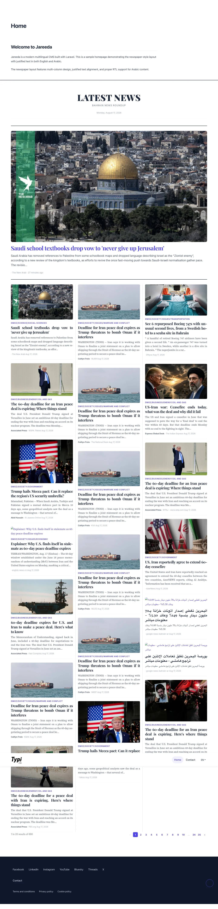
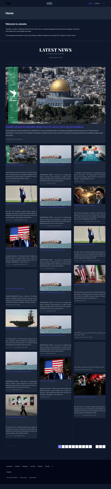
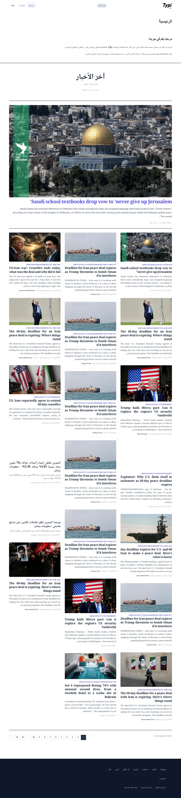
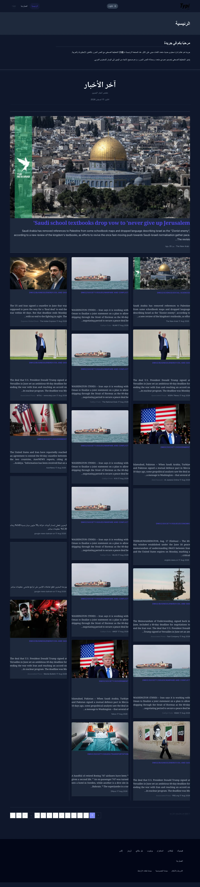

# News Pipeline Documentation

## Overview

Jareeda's news pipeline fetches, stores, and displays Bahrain news articles in a classic newspaper layout for both English and Arabic audiences.

## Architecture

```
┌─────────────────────────────────────────────────────────────────┐
│                        DATA SOURCES                              │
├──────────────────┬──────────────────┬───────────────────────────┤
│  NewsAPI.ai      │  NewsData.io     │  RSS Feeds                │
│  (Event Registry)│  (pub_f18d...)   │  (11 sources)             │
│  100 articles    │  95 articles     │  82 articles              │
└────────┬─────────┴────────┬─────────┴──────────┬────────────────┘
         │                  │                     │
         └──────────────────┼─────────────────────┘
                            │
                   ┌────────▼────────┐
                   │   DATABASE      │
                   │  typicms_news   │
                   │  690 articles   │
                   │  (2026-08-17)   │
                   └────────┬────────┘
                            │
              ┌─────────────┼─────────────┐
              │             │             │
     ┌────────▼───┐  ┌─────▼──────┐  ┌──▼───────────┐
     │  Scraping  │  │  Image     │  │  Homepage    │
     │  (Playwright│  │  Pipeline  │  │  Rendering   │
     │  + cURL)   │  │            │  │              │
     └────────────┘  └────────────┘  └──────────────┘
                            │
                   ┌────────▼────────┐
                   │  IMAGE SOURCES  │
                   ├─────────────────┤
                   │ RSS images      │
                   │ og:image scrape │
                   │ NewsAPI.ai      │
                   │ Unsloth FLUX2   │
                   │ SVG placeholders│
                   └─────────────────┘
```

## Gotcha: config caching hides `.env` changes

If `bootstrap/cache/config.php` exists (created by `php artisan config:cache`), Laravel stops reading `.env` for anything **outside** `config/*.php` files — a raw `env('NEWSAPI_KEY')` call in a command class silently returns `null` even though the key is set, while `php artisan config:clear` and a `config()` call against a defined `config/services.php` key keep working correctly. This bit `news:fetch-newsapi` in production once already ([`FetchNewsApiAi.php`](../app/Console/Commands/FetchNewsApiAi.php) now reads `config('services.newsapi.key')` instead of `env()`, matching this project's convention of never calling `env()` outside config files).

If a fetch command reports a key as "not set" despite it being present in `.env`, run `php artisan config:clear` first before assuming the key itself is wrong.

## Commands — Core vs Deprecated

> Core = used in production / `news:pipeline`. Deprecated = kept for BC, will be removed (see README Artisan table).

### Core — Fetching Articles

```bash
# Orchestrator (fetch all 3 families + dedup + optional images)
php artisan news:pipeline --days=7 --limit=500 --images --unsloth

# Fetch from NewsAPI.ai (Event Registry) - 12h cache newsapi_bahrain_*
php artisan news:fetch-newsapi --days=7 --limit=100 --language=en,ar --force

# Fetch from NewsData.io - 1h cache, paginated
php artisan news:fetch-newsdata --days=7 --limit=100 --pages=10

# Fetch from RSS feeds (8 sources)
php artisan news:fetch-bahrain --days=7 --limit=100

# Scrape full article content with Playwright (optional)
php artisan news:scrape-content --limit=50
```

### Core — Image Generation (preferred, explicit)

```bash
# 1) Try to scrape real og:image from article URLs
php artisan news:fetch-missing-images --limit=50

# 2) Generate AI images via Unsloth FLUX2 (requires localhost:8888)
php artisan news:generate-unsloth-images --limit=10 --force

# 3) Fallback SVG placeholders (deterministic, RTL-aware)
php artisan news:generate-placeholders --limit=50
```

### Deprecated / legacy — do not use for new automation

```bash
# Legacy wrapper DiffusionBee -> SVG (macOS only, /Applications/DiffusionBee.app)
php artisan news:ensure-images --limit=50 --diffusionbee
php artisan news:generate-images --limit=20   # DiffusionBee only
php artisan news:process-images --limit=20    # thin NewsImageService wrapper, duplicates fetch-missing-images
```

### E2E Testing — Core

```bash
# Run Playwright across 3 viewports (desktop-chrome, desktop-rtl, mobile)
npm run test:e2e
# or npx playwright test tests/e2e/screenshot-report.spec.ts --project=desktop-chrome

# Rebuild report from existing screenshots without browser
npm run test:e2e:report
open tests/e2e/report/index.html

# Legacy wrappers (use npm run test:e2e instead):
# npx tsx scripts/take-screenshots.ts
# npx tsx scripts/capture-screenshots.ts
# npx tsx scripts/check-images.ts
```

## Data Sources — Canonical (8 RSS + 2 APIs)

`NewsPipeline.php:144` defines the 8 RSS feeds; API sources are NewsAPI.ai + NewsData.io.

| Source | Type | Identifier in code | Notes |
|--------|------|---------------------|-------|
| **NewsAPI.ai** | REST API | `news:fetch-newsapi` | Event Registry, `config/services.php: newsapi`, 12h cache `newsapi_bahrain_*` |
| **NewsData.io** | REST API | `news:fetch-newsdata` | `NEWSDATA_API_KEY` env, paginated |
| **Google News EN** | RSS | `google-news-bahrain` | `https://news.google.com/rss/search?q=Bahrain+when:7d&hl=en` |
| **Google News AR** | RSS | `google-news-bahrain-ar` | `…?q=%D8%A8%D8%AD%D8%B1%D9%8A%D9%86+when:7d&hl=ar` |
| **BBC Middle East** | RSS | `bbc-mideast` | `feeds.bbci.co.uk/.../middle_east/rss.xml` |
| **Gulf News Bahrain** | RSS | `gulf-news-bahrain` | `gulfnews.com/rss/bahrain` |
| **Khaleej Times Bahrain** | RSS | `khaleej-times-bahrain` | `khaleejtimes.com/rss/bahrain` |
| **Bahrain Mirror** | RSS | `bahrain-mirror` | `bahrainmirror.com/rss.xml` |
| **Al-Ayam** | RSS | `alayam` | `feeds.feedburner.com/alayam` |
| **Al Jazeera** | RSS | `aljazeera-bahrain` | `aljazeera.com/xml/rss/all.xml` |

## Image Pipeline

1. **RSS Feed Images** — Extracted from `media:content`, `enclosure`, or HTML in description
2. **Article URL Scraping** — Follow redirects, extract `og:image` meta tag
3. **Unsloth FLUX2** — AI-generated editorial images using FLUX.2-klein-4B-GGUF model
4. **SVG Placeholders** — Unique, category-colored placeholders with article title and RTL support, used as a last-resort fallback when DiffusionBee/Unsloth are unreachable or no `og:image` exists

### Gotcha: placeholders block re-scraping

`news:ensure-images` writes its SVG placeholder path directly into the `image` column ([`GenerateArticleImages.php`](../app/Console/Commands/GenerateArticleImages.php)). `news:fetch-missing-images` only targets rows where `image` is null/empty, so once an article has a placeholder it's permanently skipped by the scraper — running `fetch-missing-images` again reports "All articles already have images" even for rows that only ever got a placeholder.

To retry real-image scraping for placeholder rows, null out `image` first, then re-run the scraper:

```bash
php artisan tinker --execute="\App\Models\News::where('image', 'like', '%news-images/placeholder_%')->update(['image' => null]);"
php artisan news:fetch-missing-images
```

`news:fetch-missing-images` also throws an unhandled `ConnectionException` and stops the whole run on a single slow/unreachable host (each article is saved as it's processed, so progress isn't lost — just re-run the command to pick up where it left off).

### Unsloth Configuration

- **Endpoint**: `http://localhost:8888`
- **Model**: `unsloth/FLUX.2-klein-4B-GGUF` (Q4_K_M quantized)
- **Image Size**: 1024×768 (newspaper aspect ratio)
- **Load Endpoint**: `/api/inference/images/load`
- **Auto-load**: Models are loaded on-demand before generation

## Caching Strategy

| Source | Cache TTL | Cache Key |
|--------|-----------|-----------|
| NewsAPI.ai | 12 hours | `newsapi_bahrain_*` |
| NewsData.io | 1 hour | `newsdata_*` |
| RSS Feeds | No cache | Direct fetch |
| Image URLs | Permanent | Database `image` column |

## Database Schema — Actual

```sql
-- news table (app custom, not typicms_news) — database/migrations/2026_08_14_000001_create_news_table.php:14
CREATE TABLE news (
    id INTEGER PRIMARY KEY,
    slug VARCHAR UNIQUE NOT NULL,
    title JSON NOT NULL,          -- {en: "...", ar: "..."} stored as JSON, casts array
    body JSON,                    -- {en: "...", ar: "..."} nullable
    excerpt JSON,                 -- {en: "...", ar: "..."} nullable
    url VARCHAR,                  -- source article URL
    source VARCHAR,
    author VARCHAR,
    image VARCHAR,                -- URL or /storage/news/... / placeholder SVG
    image_alt VARCHAR,
    ai_generated_image BOOLEAN DEFAULT 0,
    ai_generated_image_path VARCHAR,
    category VARCHAR,
    language VARCHAR(2) DEFAULT 'en', -- en | ar (App\Models\News: forLanguage scope)
    published_at DATETIME,        -- indexed
    is_featured BOOLEAN DEFAULT 0, -- scopeFeatured()
    created_at TIMESTAMP,
    updated_at TIMESTAMP,
    UNIQUE(slug), INDEX(published_at), INDEX(category), INDEX(language)
);
-- Note: app/Models/News.php:35 table='news', casts title/body/excerpt=>array
-- TypiCMS news module is NOT installed (bootstrap/providers.php:22 commented) — this is a standalone model.
```

## SEO Structured Data

The homepage includes three JSON-LD schemas:

1. **WebSite** — Site name, description, search action, publisher
2. **NewsArticle** — Featured article with full metadata
3. **ItemList** — Top 10 articles as a structured list

## Frontend

- **Layout**: Classic newspaper with multi-column justified text
- **Fonts**: Playfair Display, Source Serif 4, Inter, Noto Naskh Arabic, Amiri
- **RTL**: Full Arabic RTL support with `dir="rtl"` on `<html>` element
- **Responsive**: Container-based layout with Bootstrap 5 grid
- **Images**: Lazy loading for non-featured images, eager for featured
- **Dark mode**: Toggle button injected next to the offcanvas nav (`resources/js/public/dark-mode.ts`), persisted to `localStorage` under `jareeda-theme`, defaults to `prefers-color-scheme`. Theme state lives in `data-theme` on `<html>`; overrides are in `resources/scss/public/_dark-mode.scss`.

### Screenshots

| Light · English | Dark · English |
|---|---|
|  |  |

| Light · Arabic (RTL) | Dark · Arabic (RTL) |
|---|---|
|  |  |

Captured via Playwright against `php artisan serve`; regenerate with the same tool after frontend changes.

### Gotcha: rebuilding frontend assets

After any change under `resources/js` or `resources/scss`, run `bun run build` (or `bun run dev` for hot reload) — see [CLAUDE.md](../CLAUDE.md#frontend-bundling). Two additional traps observed while working on dark mode:

- **Undefined Sass variables silently break the whole build** (not just one file): `_newspaper.scss` referenced `$font-family-serif`/`$font-family-arabic`, which were never defined (the file's actual variables are `$newspaper-headline-font` / `$newspaper-arabic-headline-font`), and this failed the *admin* bundle too, since `admin.scss` transitively imports `public.scss`.
- **`php artisan serve` can keep serving a stale Vite manifest hash after a rebuild.** If the built JS/CSS filename in the rendered HTML doesn't match `public/build/manifest.json`, run `php artisan optimize:clear` (not just `view:clear`) and, if that doesn't help, restart the `serve` process — it can hold worker state across requests.
- **Duplicate module initialization can silently cancel itself out.** `dark-mode.ts` used to both self-initialize on import *and* get called explicitly from `resources/js/public.js`, registering its click listener twice — every click toggled the theme forward then immediately back, so the button appeared to do nothing with no console error. Modules that export an explicit init function (matching the other `resources/js/public/*.ts` helpers) should not also auto-run on import.

## Files — Core

| File | Purpose | Core? |
|------|---------|-------|
| `app/Console/Commands/FetchNewsApiAi.php` | NewsAPI.ai fetcher (12h cache) | ✅ |
| `app/Console/Commands/FetchNewsDataIo.php` | NewsData.io fetcher paginated | ✅ |
| `app/Console/Commands/FetchBahrainNews.php` | RSS 8-feed aggregator | ✅ |
| `app/Console/Commands/NewsPipeline.php` | **Orchestrator** fetch+dedupe+images | ✅ |
| `app/Console/Commands/ScrapeArticleContent.php` | Playwright content scrape | ⚠️ |
| `app/Console/Commands/FetchMissingImages.php` | og:image scraper | ✅ |
| `app/Console/Commands/GeneratePlaceholderImages.php` | SVG placeholder | ✅ |
| `app/Console/Commands/GenerateUnslothImages.php` | Unsloth FLUX2 | ✅ |
| `app/Console/Commands/GenerateArticleImages.php` | Legacy DiffusionBee→SVG wrapper (`news:ensure-images`) | ❌ deprecated |
| `app/Console/Commands/GenerateDiffusionBeeImages.php` | DiffusionBee only (`news:generate-images`) | ❌ deprecated |
| `app/Console/Commands/ProcessArticleImages.php` | `NewsImageService` wrapper (`news:process-images`) | ❌ deprecated |
| `app/Services/UnslothImageService.php` | Unsloth API client (`generate`, `isHealthy`, `ensureModelLoaded`) | ✅ |
| `app/Services/NewsImageService.php` | Download→scrape→AI tiered fallback | ✅ |
| `app/Models/News.php` | `table=news`, scopes `published/recent/forLanguage/featured` | ✅ |
| `app/Jobs/GenerateArticleImage.php` | Queueable AI job (`ai-images` queue, redis) | ✅ |
| `app/Events/ArticleImageGenerated.php` / `Failed` | Job events | ✅ |
| `app/Http/Controllers/Admin/AiImageController.php` | `POST /admin/news/{id}/generate-image` etc | ✅ |
| `routes/ai-image.php` | AI admin routes | ✅ |
| `config/unsloth.php` | Endpoint/model/storage/queue config | ✅ |
| `resources/views/public/pages/home.blade.php` | Newspaper homepage + 3× JSON-LD | ✅ |
| `resources/scss/public/_newspaper.scss` | Masthead/featured/article grid | ✅ |
| `resources/scss/public/_dark-mode.scss` + `resources/js/public/dark-mode.ts` | Dark mode | ✅ |
| `resources/scss/public/_fonts.scss` | Playfair/Source Serif/Inter/Noto Naskh/Amiri | ✅ |
| `tests/e2e/screenshot-report.spec.ts` | **Playwright core test** (5 pages × 3 viewports) | ✅ |
| `tests/e2e/generate-report.ts` | Standalone report builder (`npm run test:e2e:report`) | ⚠️ helper |
| `playwright.config.ts` | 3 projects: desktop-chrome/desktop-rtl/mobile-chrome | ✅ |
| `scripts/diffusionbee_standalone.php` | DiffusionBee JSON backend | ❌ macOS-only |
| `scripts/capture-screenshots.ts` / `take-screenshots.ts` / `check-images.ts` | Legacy capture wrappers | ❌ use `npm run test:e2e` |
| `scripts/fix-images.php` / `generate-report.php` | Legacy helpers | ❌ |
