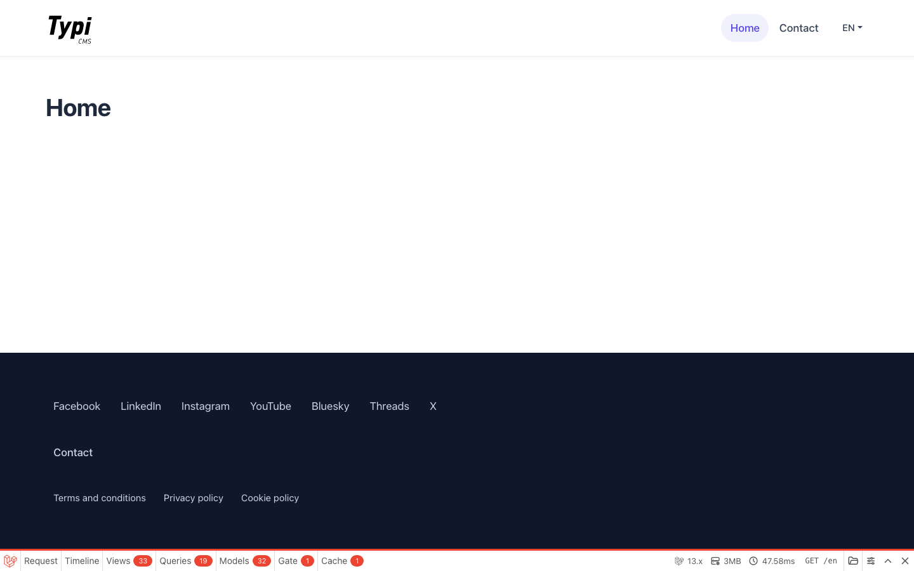
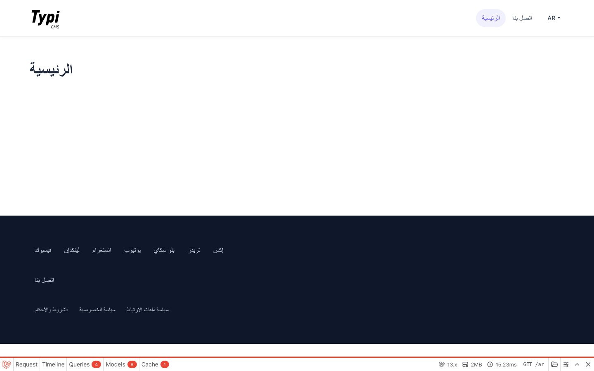
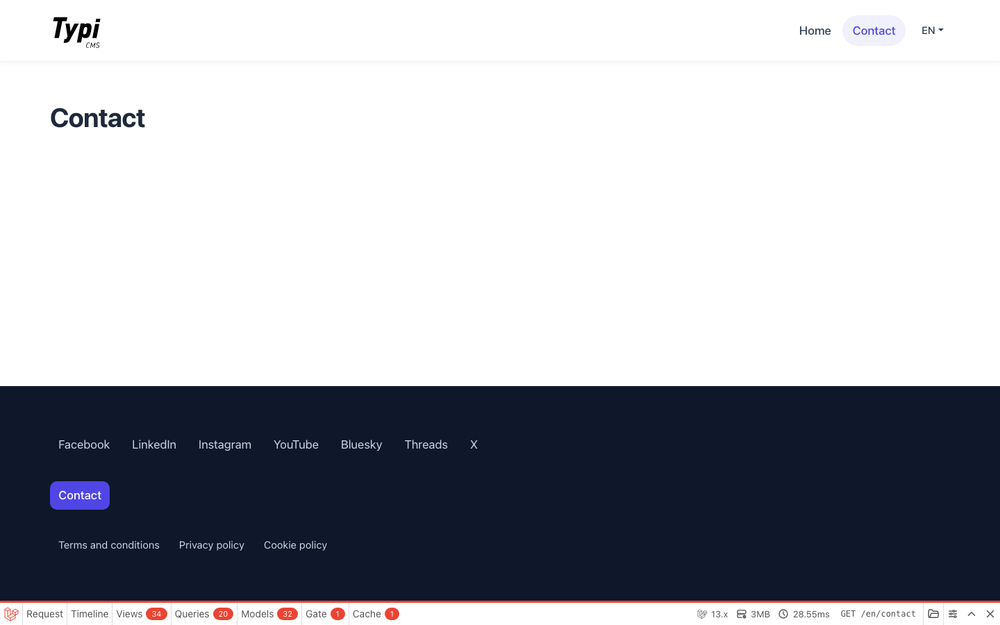
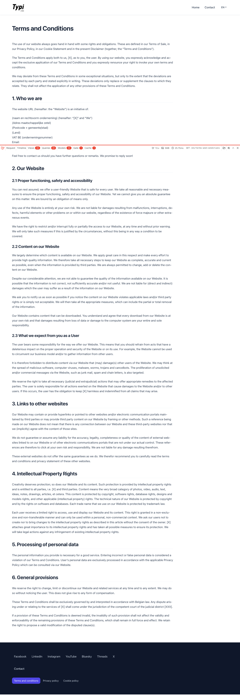
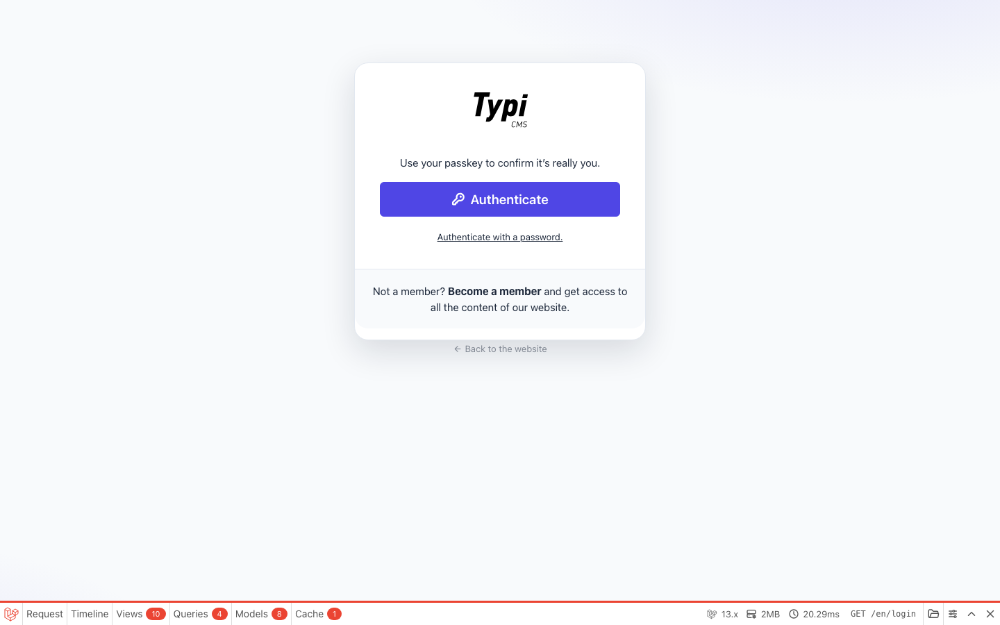
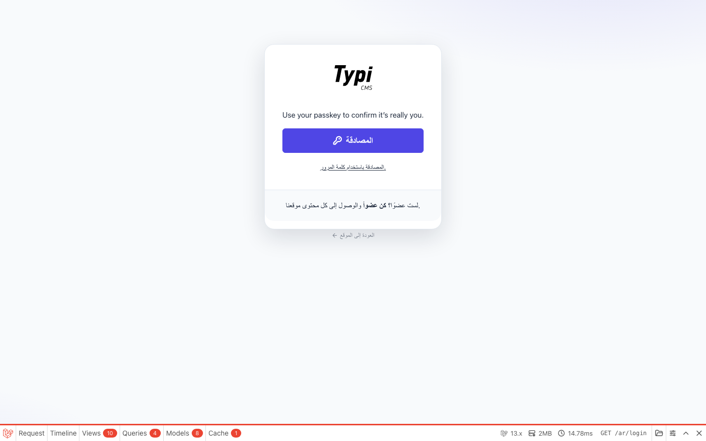
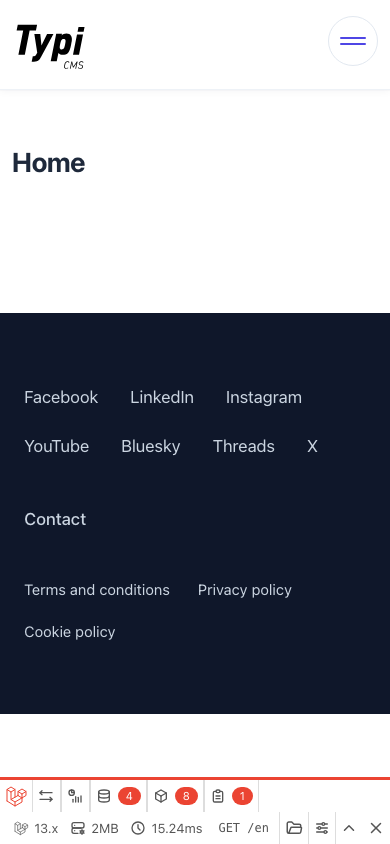
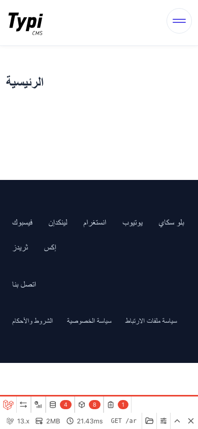

# Jareeda stack upgrade — 12 August 2026

Visual and runtime review after moving Jareeda from Laravel 12 / TypiCMS 15 to Laravel 13 / TypiCMS 17.

Decision record: [ADR-001](decisions/ADR-001-laravel-13-typicms-17.md).

## Approved stack

| Layer | Installed |
| --- | --- |
| PHP | 8.5.9 |
| Laravel | 13.25.0 |
| TypiCMS Core | 17.0.39 |
| Vite | 8.2.1 |
| laravel-vite-plugin | 3.2.0 |
| Vue | 3.5.x |
| ESLint | 10.8.1 |
| Lucide Vue | `@lucide/vue` 1.31.0 |
| Cropper.js | 2.1.1 |
| Spatie Permission | 8.3.0 |
| Locales | `en`, `ar` |

`pnpm build` completed in 6.82s. `php artisan about` reports Laravel 13.25.0.

## Screenshots

Captured against `http://127.0.0.1:8010` after the TypiCMS 17 compatibility fixes. Debugbar is visible because `APP_DEBUG=true`.

### English home — desktop 1440×900



HTTP 200. Title `Home – Jareeda`. `html[lang=en]`. Header, primary nav, footer, and language switcher render.

### Arabic home — desktop 1440×900



HTTP 200. Title `الرئيسية – جريدة`. `html[lang=ar]`. Nav labels, heading, social, and legal links are Arabic.

### English contact — desktop



HTTP 200. Contact is the active nav item. Page body is empty because the seeder has no contact content yet.

### English terms — desktop



HTTP 200. Legal page route from the seeder still resolves.

### Login — English



HTTP 200. Passkey-first TypiCMS 17 auth card. Password fallback and membership links are present.

### Login — Arabic



HTTP 200. Button and supporting copy are Arabic. The passkey hint line is still English (`Use your passkey to confirm it’s really you.`).

### English home — mobile 390×844



Hamburger replaces the desktop nav.

### Arabic home — mobile 390×844



Arabic heading and footer; hamburger control is present.

## Runtime checks

| URL | Result |
| --- | --- |
| `/en` | 200 |
| `/ar` | 200 |
| `/en/contact` | 200 |
| `/en/terms-and-conditions` | 200 |
| `/en/login` | 200 |
| `/ar/login` | 200 |
| `/admin` | 302 → `/en/login` |

## Fixes applied during this review

Public pages were 500 immediately after the Composer bump. These TypiCMS 17 application files were still on the v15 contract:

1. **`bootstrap/app.php`** — removed `SetNavbarLocale` (class deleted in Core 17). Guest redirect now uses `enabledLocales()` / `mainLocale()`.
2. **`app/helpers.php`** — added `showAdminButtons()`, `imageOrDefault()`, and `adminLocales()` from the TypiCMS 17 helper stub.
3. **Composer** — added `spatie/laravel-responsecache` and `spatie/laravel-markdown-response`. Auth routes alias `DoNotCacheResponse`; without the package, `/en/login` 500s.
4. **Public middleware** — registered `ProvideMarkdownResponse` and `CacheResponse` to match Core 17.

## Known follow-ups (not blocking this upgrade)

- **Document direction.** `html` has `lang="ar"` but no `dir="rtl"`. TypiCMS 17 layouts also omit `dir`. Arabic copy is correct; chrome stays LTR. A published public/auth layout should set `dir` from locale.
- **Login JS.** `/en/login` and `/ar/login` log `Cannot read properties of undefined (reading 'locale')` and `alertify is not defined`. Login is on the `public` middleware group, which does not run `JavaScriptData`.
- **Passkey string.** Arabic login still shows one English passkey sentence.
- **Swiper.** Left on 12.2.0; 14.1.0 is a separate breaking change.
- **No automated tests.** There is no `tests/` directory. Verification is artisan, HTTP, Playwright screenshots, and `pnpm build`.

## Commands

```bash
composer update --no-interaction --with-all-dependencies
pnpm install
pnpm build
php artisan about --no-interaction
php artisan serve --host=127.0.0.1 --port=8010 --no-interaction
```
